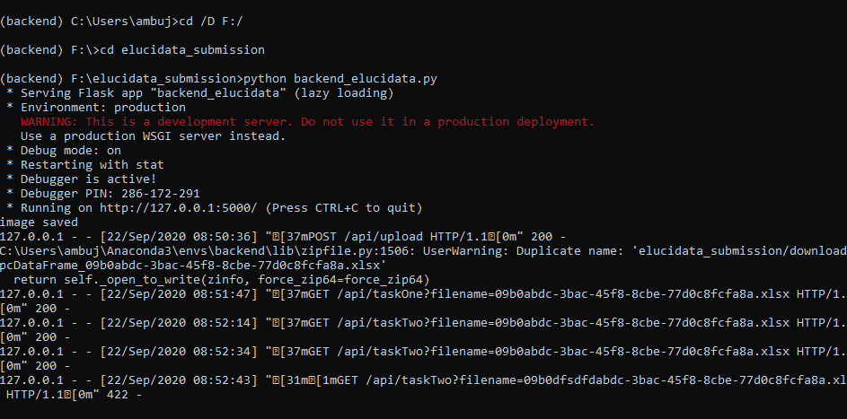

# Flask Dependency

## Virtual enviornment
activate your virtualenv, Used anaconda interface to create custom made enviornment

## Install Dependencies
pip install -r requirements.txt 

## Run the file
python backend_elucidata.py

This will run at 5000 port. Proxy used at frontend side to send request at 4200 port.
